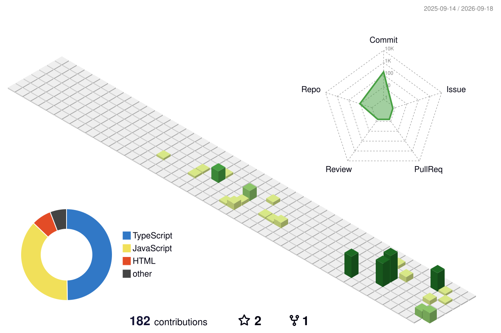

<div align="center">

```
  Jungtz — build things that matter.
```

<br />


<br />

<p>
  <a href="https://github.com/Jungtz"></a>&ensp;
  &ensp;
  
</p>

</div>

---

### —

極簡主義。專注本質。寫可維護的程式碼，做可被驗證的決策。

不追潮流，只做經得起時間檢驗的東西。

<br />

### Tech Stack

<div align="center">


<br />


<br />


</div>

<table>
<tr>
<td width="50%" valign="top">

**— Frontend**

`Vanilla JS` · `TypeScript` · `SCSS` · `Vite` — Mobile-First, Memoization, SEO / GA

</td>
<td width="50%" valign="top">

**— Backend / AI**

`Node.js` · `Express` · `OpenAI API` · `RAG` · `Agents` · `MCP` — `Ollama` / `llama-server` 在地推理

</td>
</tr>
<tr>
<td valign="top">

**— Data**

`MongoDB` · `SQLite` · `MSSQL` — 多資料層並行

</td>
<td valign="top">

**— Tools / Workflow**

`Git` · `GitHub` · `opencode` 驅動開發 — discipline, no noise, just signal

</td>
</tr>
</table>

<sub>— Node.js 全端 · Vanilla JS 為核心 / SCSS + Vite；資料層 MongoDB · SQLite · MSSQL；AI 以 OpenAI API 為核心，延伸 RAG / Agent / MCP，並以 Ollama / llama-server 在地推理，搭配 opencode 驅動開發。</sub>

---

### GitHub Stats

<div align="center">


<br />


</div>

#### 3D · contrib

> 每日自動更新 · `profile-3d-contrib/profile-green-animate.svg`

<div align="center">

<picture>
  <source media="(prefers-color-scheme: dark)" srcset="./profile-3d-contrib/profile-night-rainbow.svg" />
  <source media="(prefers-color-scheme: light)" srcset="./profile-3d-contrib/profile-green-animate.svg" />
  
</picture>

</div>

<sub>— 立體提交牆。時間的切面，綠格是足跡。</sub>

#### snake · animate

<div align="center">

<picture>
  <source media="(prefers-color-scheme: dark)" srcset="https://raw.githubusercontent.com/Jungtz/Jungtz/output/github-contribution-grid-snake-dark.svg" />
  <source media="(prefers-color-scheme: light)" srcset="https://raw.githubusercontent.com/Jungtz/Jungtz/output/github-contribution-grid-snake.svg" />
  
</picture>

</div>

<sub>— 貪吃蛇吃掉你的 green squares。由 GitHub Actions 每 24h 重繪。</sub>

---

<div align="center">

```
$ uptime
  Jungtz has been coding since 2017 — still curious, still shipping.
```

<br />

<sub>— Built with discipline. No noise, just signal. —</sub>

</div>
